# Smart Access Control System (Industry 4.0)

A modular, IoT-enabled access control prototype featuring AI-powered facial recognition, Automatic License Plate Recognition (ALPR), and distributed edge hardware for automated gate and door actuation.

---

## Strategic Context

Developed as an independent personal project (originating as a one-man "group project"), this system presents a low-cost, high-efficiency alternative to traditional key- and passcode-based access systems by integrating:

- Edge computing
- Centralized AI processing
- Real-time database logging
- Distributed hardware actuation

The system addresses common weaknesses in conventional access control such as duplicated keys, shared passcodes, and inconsistent entry logging.

---

## Beam Robotics Integration

This smart access system serves as a flagship hardware product for **Beam Robotics**, a co-founded initiative focused on secure, scalable IoT and robotic deployments with integrated monitoring dashboards. Each unit pairs directly with the Beam Robotics cloud infrastructure, providing encrypted, secure access per device owner. 

The platform is built to scale: customers can register as many products as they purchase to a single account. Once authenticated, users can seamlessly manage their entire hardware fleet and access each product's dedicated dashboard.

### 1. The Beam Platform
The central hub for Beam Robotics products manages the ecosystem of deployed units and provides a unified entry point for hardware control and monitoring.

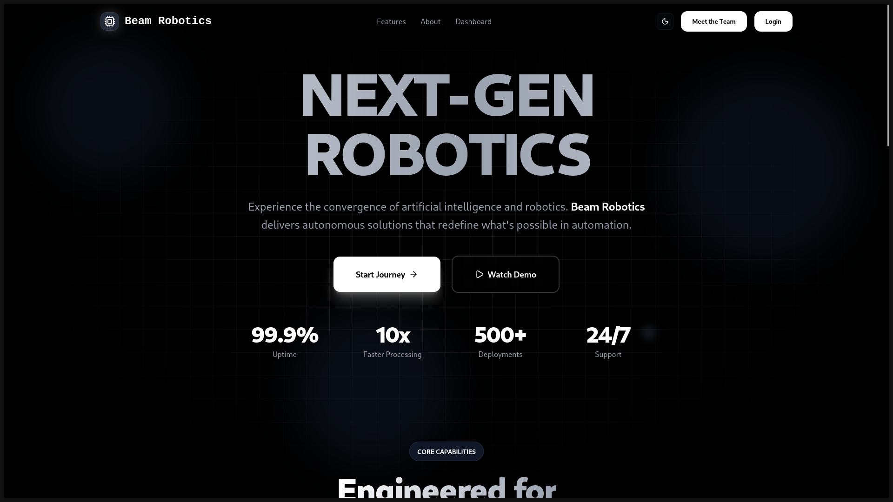

### 2. Fleet Management & Product Selection
After authentication, customers access a private fleet interface showing only the systems and robots registered to their specific account.
- **Unlimited Registration:** Add as many purchased products as needed using a unique cryptographic key.
- **Exclusive Access:** Only the verified owner can access the device dashboard.
- **Customization:** Configuration of product-specific add-ons (cameras, ALPR sensors, expansion modules).

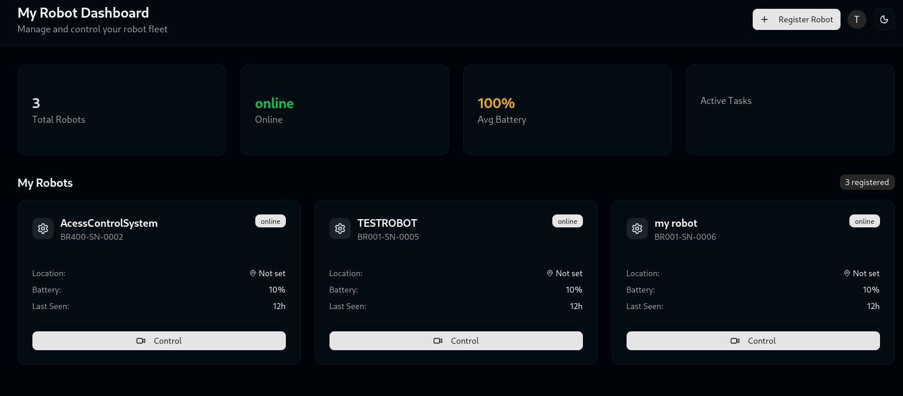

### 3. Live Command Dashboard
Selecting a registered unit opens its dedicated command center, featuring encrypted low-latency video feeds, real-time access logs, and live telemetry for remote gate and door actuation.

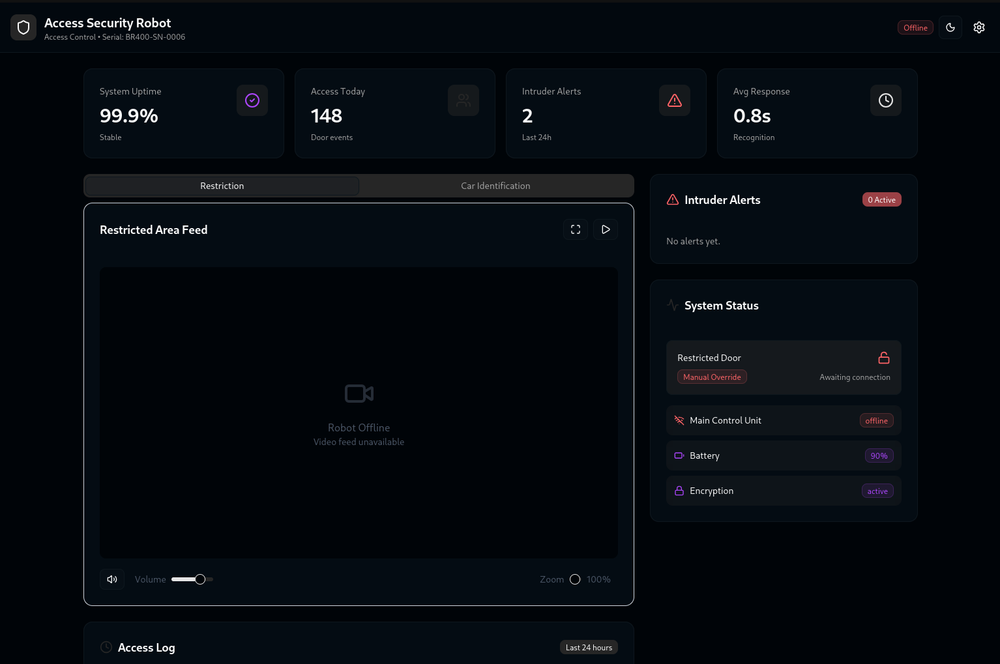

---

## Project Objectives

- **Biometric & Vehicular Access:** Facial recognition for pedestrian authentication and ALPR for vehicle verification.
- **Distributed Edge Actuation:** Peripheral microcontrollers (ESP32 / Arduino Uno) autonomously control locks, servos, and sensors.
- **Centralized AI Core:** Deep-learning inference server with centralized SQLite logging for accountability and traceability.

---

## System Architecture

The system follows a hybrid centralized–distributed architecture:

- **Central AI Hub:** A High-Performance Compute Node.
- **Edge Node Fleet:** Microcontroller-Based Actuation Units.

Communication is handled via Wi-Fi, UDP, Socket.IO, and ESP-NOW protocols.

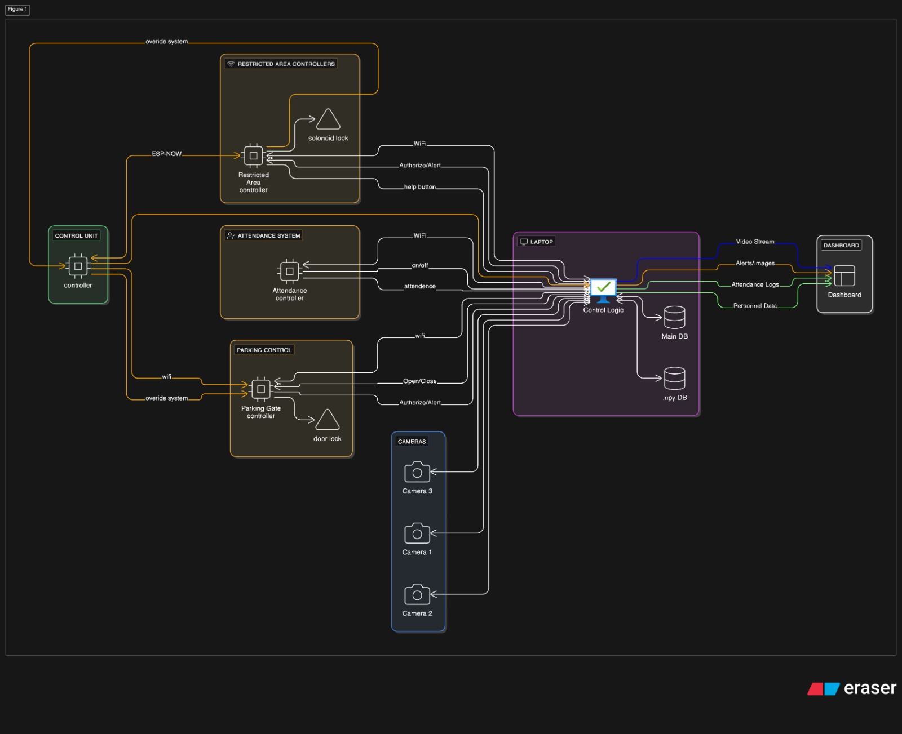
*Figure 1: System Architecture Diagram showing the data flow between cameras, the central laptop, and distributed controllers.*


*Figure 2: Operational Logic and Flowchart of the multi-threaded system.*

---

## 1. Centralized AI Hub

A Python-based application running on a PC handles computationally intensive tasks. It ingests three USB webcam feeds, communicates with edge nodes via network protocols, and logs all access attempts into SQLite databases.

> **Note on Facial Recognition:** This repository utilizes the same robust facial recognition engine I developed for my [Autonomous Security Robot](https://github.com/xaatim/Autonomous_security_robot).

### Core Responsibilities
- Face embedding comparison using cosine similarity (InsightFace `antelopev2`).
- License plate extraction and validation (EasyOCR).
- Intrusion detection and snapshot capture.
- Real-time decision dispatch to edge controllers.

---

## 2. Edge Node Fleet (Hardware Prototypes)

Each hardware unit is programmed using PlatformIO and written in C/C++. The physical prototype is divided into four main operational parts:

### I. Vehicle Access Unit (Parking Gate)
Controls a servo motor (boom gate) via an Arduino Uno. It receives serial commands from the central Hub to open the gate upon verified ALPR confirmation, and utilizes an ultrasonic sensor (HC-SR04) for vehicle presence and safety clearance.
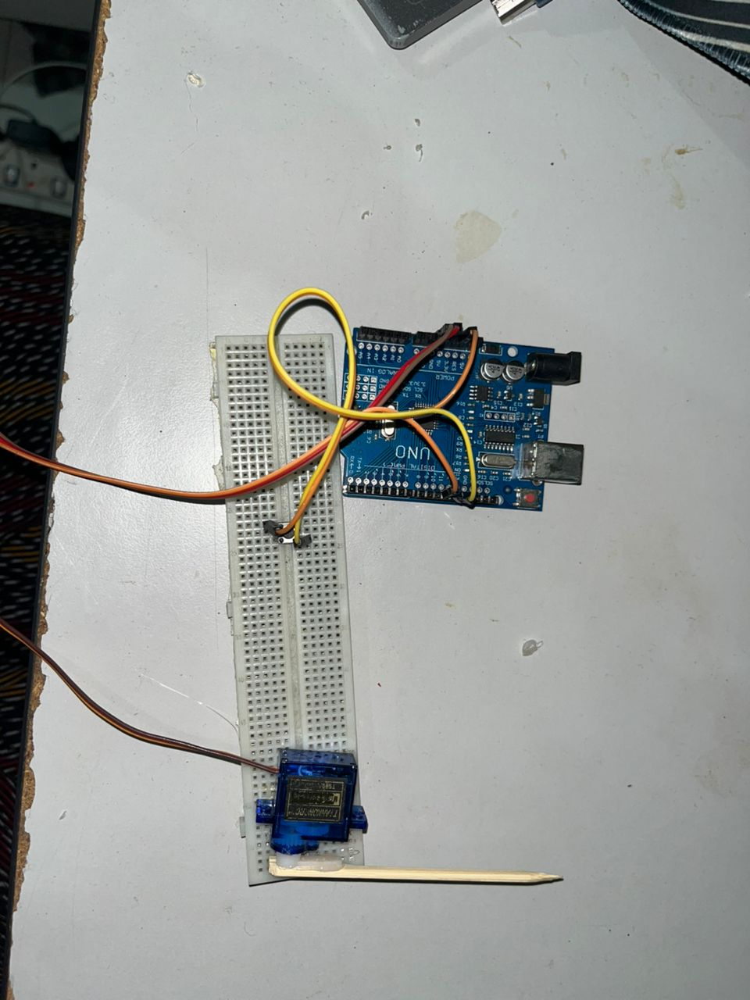

### II. Restricted Area Unit (Smart Door)
An ESP32-based controller that actuates 12V solenoid locks for high-security doors. It captures local voice input via an I2S MEMS microphone (INMP441) and outputs audio via a Class-D I2S amplifier (MAX98357A).
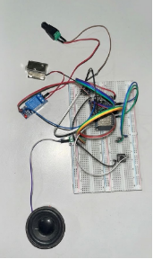

### III. Attendance Unit
Logs authorized entry and exit timestamps. It operates on an event-driven model via an ESP32-C3 Super Mini to wake the camera, run a 15-second scanning window, and update `attendance.db`.
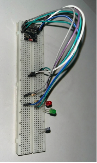

### IV. Main Control Unit (Walkie-Talkie & Override)
A handheld ESP32 device acting as a master safety override and communication module. It allows security personnel to force-open doors or establish two-way voice communication with the Restricted Area Unit via ESP-NOW.
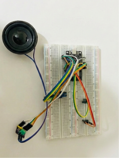

---

## Computer Vision Performance

### Environmental Robustness & Occlusion
- Maintains high accuracy in low-light conditions (<50 lux) and dynamic outdoor luminance variation.
- Masked-face trials showed predictable cosine similarity drops; severely occluded faces are strictly flagged as **Unknown**.

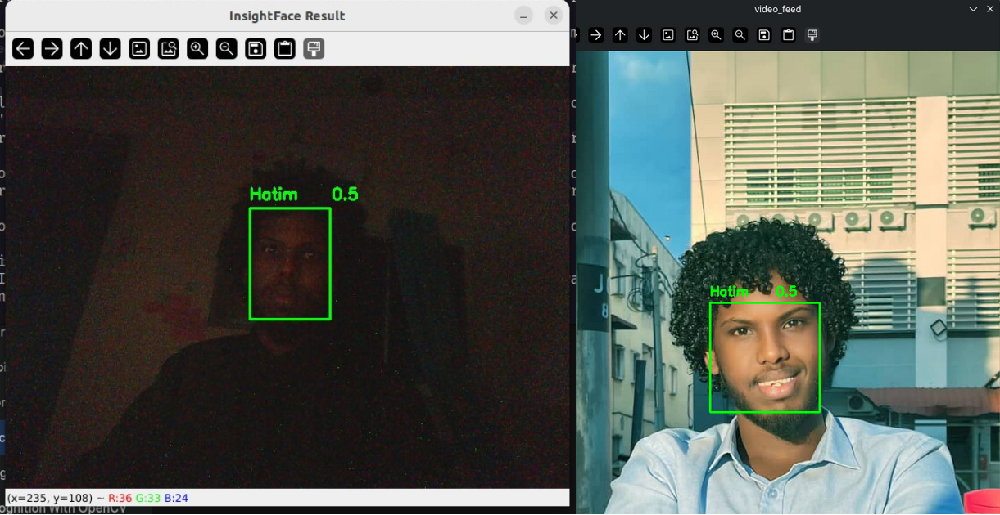
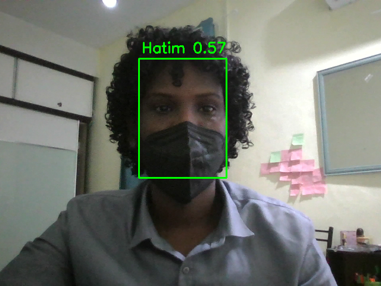

### Performance Metrics (Threshold: 0.5 Cosine Similarity)
During 200 independent validation trials, the system demonstrated:
- **True Positive Rate (TPR):** 88%
- **True Negative Rate (TNR):** 100%
- **False Acceptance Rate (FAR):** 0%

This ensures zero false positives, meaning no unauthorized individuals were incorrectly granted access.

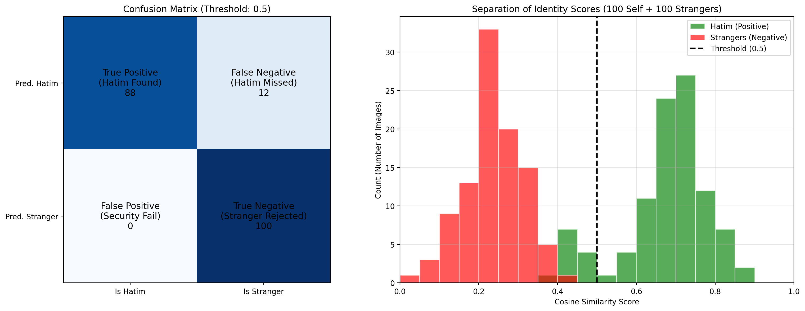

### License Plate Recognition (ALPR)
The system extracts alphanumeric text via EasyOCR and verifies it against `vehicles.db`. Unregistered plates trigger an alert and keep the physical gate closed.


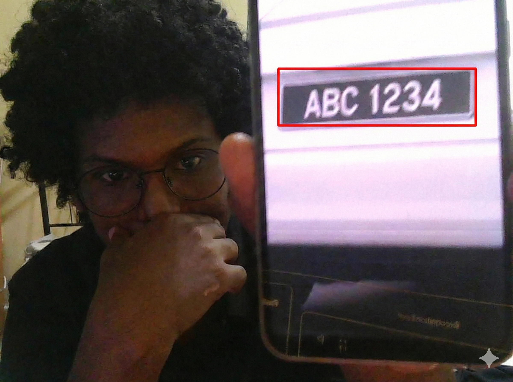

### Dashboard Alerting
When an unknown person is detected, an intrusion event instantly sends a snapshot via WebSocket to a central monitoring dashboard with a latency of < 1 second.

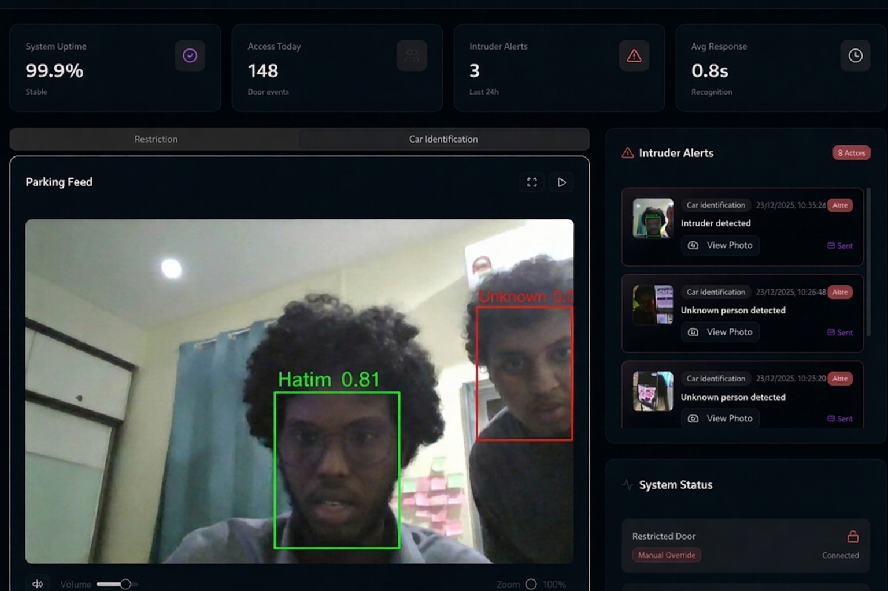

---

## Technology Stack

### Languages


### Frameworks & Libraries


### Hardware & Firmware


### Database


---

## Repository Structure

```text
SmartAccessControl/
├── firmware/
│   ├── attendance_unit/
│   ├── main_control_unit/
│   ├── parking_gate_unit/
│   └── restricted_areas_unit/
├── src/
│   ├── images/
│   ├── database_handler.py
│   ├── recognition.py
│   ├── car_identification.py
│   └── socketio.py
├── data/
│   ├── face_embeddings.npy
│   └── *.db
├── docs/
│   └── images/               # Documentation images for this README
├── main.py
└── README.md

---

## Installation & Usage

### 1. Prerequisites

* Python 3.8+
* PlatformIO extension (VS Code)
* ESP32 / Arduino boards
* USB webcams

### 2. Setup Central Hub

```bash
git clone [https://github.com/xaatim/smartaccesscontrol.git](https://github.com/xaatim/smartaccesscontrol.git)
cd smartaccesscontrol
pip install -r requirements.txt

```

Ensure the following heavy libraries are properly installed:

* `InsightFace`
* `PyTorch`
* `OpenCV`
* `EasyOCR`

### 3. Flash Edge Nodes

1. Open the project in VS Code.
2. Navigate to your desired firmware directory (e.g., `firmware/restricted_areas_unit/`).
3. Connect the microcontroller.
4. Build & Upload using PlatformIO.

### 4. Run the System

```bash
python main.py

```

---

## Contributor

**Hatim Ahmed Hassan** *Lead Developer & System Architect* Universiti Tun Hussein Onn Malaysia (UTHM)

## License

This project is licensed under the MIT License. See the `LICENSE` file for details.

```

```